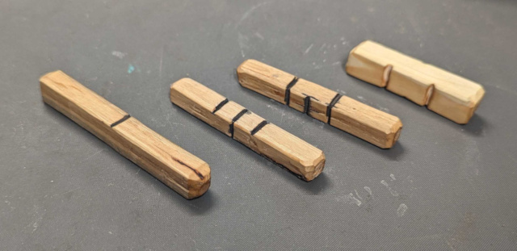

## Survival Solo RPG:

Use three d4 dice valued 0 to 3. Use some kind of tokens to indicate attributes. Attribute default values can be represented by notches on a stick, etc.

Example dice:

### Oracle:
Roll one die as an oracle.  Roll multiple times to get modifiers.

| Die  | Attribute | Element | Race  | Relationship| Fighting Style | Gender     | No / Yes       |
|------|-----------|---------|-------|-------------|----------------|------------|----------------|
| 0    | HP        | Earth   | Dwarf | Family      | Support        | Manly man  | Definitely No  |
| 1    | STR       | Water   | Human | Friend      | Fighter        | Male       | Probably No    |
| 2    | DEX       | Air     | Elf   | Lovers      | Thief          | Female     | Probably Yes   |
| 3    | INT       | Fire    | Beast | Enemy       | Magic User     | Girly girl | Definitely Yes |

For ranged values, roll two dice to get a value from 0 (very bad) to 6 (very good) with 3 being the average.

### Races

**Dwarf:** Elemental magic. Durable elemental weapons.

**Human:** Electrical magic. Electronics. Constructs. Complex mechanical traps. Complex weapons such as firearms, crossbows, etc.

**Elf:** Any nature / spiritual magic, healing others, golems, sentient weapons.

**Beast-kin:** Self transformation / boosting magic. Can change into an animal with +1/2 point per level, rounded up, to attributes based on animal type. Can change into humanoid with +1/2 point per level, rounded up, to INT. Animal form cannot use weapons or armor. Can only use magic in natural form. The difficulty to transform is easy (2) using the unmodified INT level.

Any race can learn the magic of another race through practice. Since this is not natural for the race, no more than 3 spells from other races can be learned. If you can keep track of it, these spells should start at level 1 and get upgraded the same way as other attributes, through leveling.

### Character

**Attributes:** Each cAttackingharacter has four attributes. (See Oracle) Start with 12 points and distribute as desired. Attributes have a starting max level of 4 and have a game max level of 9, though item bonuses can bring it higher.

**Lucky Shots:** You may trade one or more attribute point for 3 lucky shots each. One lucky shot is exchanged for an extra roll at any time. Lucky shots are restored when you get XP. Lucky shots use the same number of dice as the current level if used after you start rolling. If used before you start rolling, each lucky shot will increase the level of the roll by one.

**Charisma:** Charisma uses INT. Roll INT for both characters. Must beat the target's score to win. Modifiers can be used based on the circumstances.

### Fighting

**Rolling the dice:** Level 1-3 uses one die (0-3) per roll. Level 4-6 uses 2 dice (0-6) per roll. Level 7+ uses 3 dice (0-9) per roll. For each level after the minimum level for that number of dice, roll the dice again and use the highest roll. (level 2 rolls one die twice, level 6 rolls two dice 3 times) Modifiers from items, spells, etc. modify the level, not the final value.

**Challenge Difficulties:** Difficulty is in the Fibonacci sequence: Trivial(1), Easy(2), Medium(3), Hard(5), and Heroic(8). Roll to match or better.

**Fray die:** Before hero attacks an enemy, roll one die. If it's a 3, do 1 damage to the opponent before attacking. These are attacks "in the fray" such as off-hand dagger swipes, critical hits, etc.

**Speed (DEX) based attacks:** Attacker rolls on DEX. Defender rolls on either DEX (dodge) or STR (block). If the attacker rolls higher than the defender, the difference is the damage done.

**Strength (STR) based attacks:** Roll on DEX for both attacker and defender. If the defender rolls higher, this is the amount of damage dodged. Then the attacker and defender roll on STR. If the attacker rolls higher, this is the damage done, minus the damage dodged.

**Magic attacks:** Because of the different ways magic can be used, there are no set rules for magic. Your magic level is your INT, and can be used in place of DEX or STR using the same rules as above. These rules may be modified for the spell used, such as AoE spells. Use an INT number of tokens to indicate your magic level. Spend as many tokens as you want to cast a spell.  For each turn after that, restore one token until you reach your original INT number of tokens again.

**Damage overflow:** If you do more damage than a single enemy can take, you can spend the overflow damage on an enemy, of equal or less level, adjacent to the first. This can be repeated for as many enemies are there are, as long as they are adjacent to each other. Any one of the remaining enemies can return an attack before you attack again.

**Weapons and armor:** Weapons add (or subtract) levels to your attack rolls. Armor adds (or subtracts) levels to your defense rolls.

**Saving throws:** If poisoned, burning, etc. roll for medium difficulty (3) on your current HP. If you fail the save, you lose one HP and must roll again on your next turn. Repeat until you succeed or your HP reaches 0. If your HP reaches 0 for any reason, including battle, roll for hard difficulty (5) on INT for divine intervention. If you succeed in a divine intervention, restore 1 HP and remove all status effects. (Negative and positive)

**Breaking Objects:** Objects only have a LVL. Attacker rolls on STR to beat the LVL difficulty.

**Traps:** Traps have a LVL which must be beat with INT to disarm. LVL acts like DEX if triggered. When creating a trap, roll on INT to find the trap's LVL. A failed roll to disarm will trigger the trap.

**Constructs and Golems:** Roll on INT for the level. Use the rules for monsters to determine how many attribute points to distribute.

**Meditation:** When not in battle, you can choose to meditate. For each turn you meditate, you increase your INT by one on your next INT roll. There is also a 50% chance to be attacked by a low-level monster each turn.  If your meditation is interrupted, you loose the INT bonus and the monster attacks first.

**Leveling:** At the end of a single adventure, (or whenever you feel is right) each hero gets one XP and all spent lucky shots are restored. You need the number of the next level more XP to advance to that level. (level 4 is 4 XP higher than level 3) Each time you level up, you get 2 points you can choose to spend on any attributes or lucky shot tokens.

**Healing:** Each ally can heal up to 2 HP between battles. Elves may attempt to raise the dead, or perform a full heal, at a hard(5) difficulty. Beast-kin may attempt a full heal on themselves.

**Monsters:** A level 1 monster has 4 total attribute points. (Often one point to each attribute) Monsters level the same way as Heroes, so a level 5 monster will have 8 additional attribute points, or 12 total, the same as a level 1 hero.
