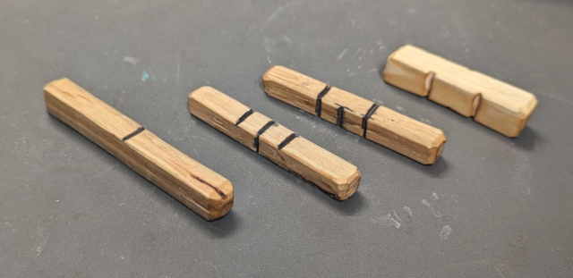

#Example dice:

### Additional notes on dice:

### I started with the standard list of elements, Earth, Water, Wind, and Fire

* Earth is the foundation. Your body / HP. The flat surface representing a flat field.
* Water is strength of movement. The ability to carve through earth. Your STR. The single line represents a river.
* Air is fast and flitting, like a bird. Your DEX. The two lines represent the movement of a breeze
* Fire has the power to modify the other elements. It is the danger of magic and the most active of the elements. Your INT. The three stripes represent the tips of a flame.

### For creatures:

* Dwarfs (Earth) live under the Earth. They work metal (Earth) using fire and wind to heat it, and water to quench it. So while they live in the Earth, they use the elements to work it.
* Humans (Water) live on the Earth. They till the Earth to plant food and build their homes. They use their strength to modify their environment the most.
* Elves (Air) are fast and light. They flit between tree branches, living high above the ground in the tree branches, using bows to attack.
* Beast-kin (Fire) are temperamental and dangerous. They're constantly changing themselves into different forms to destroy anyone in their way. The three stripes representing the swipe of a claw.

### Relations:

* The blank side is your family / foundation. Your starting point.
* The single line is your friend. The person who will stand with you.
* The two lines are the lovers, standing together.
* The three lines are danger, the swipe of a claw, or a group of people going to war.

### Roll multiple times to get modifiers. ie:

* enemy + family = A family enemy or a feud between families.
* Lovers + family = someone married.
* Lovers + friend = someone flirty or boyfriend / girlfriend.

You could choose to keep this information secret from your character. If a character is a enemy + friend, you could make him an enemy who pretends to be a friend, but will turn on your character at some point in the future.

### You can also roll two dice, as shown below, to get a range of how strong the person's actions are. ie:

* From fatherly / motherly, to an actual in-law or a family member you haven't seen in a while
* From polite to generous with their money
* From giving winks to the barmaid to happily married
* From impolite to trying to start a fight, or leaving in a huff

### Answering questions with 2 dice dealing with a range:

| dice| percent | meaning                   |
|-----|---------|---------------------------|
| 0   | 6.25%   | Very negative no, and...  |
| 1   | 12.50%  | No, and...                |
| 2   | 18.75%  | No                        |
| 3   | 25.00%  | Maybe, but...             |
| 4   | 18.75%  | Yes                       |
| 5   | 12.50%  | Yes, and...               |
| 6   | 6.25%   | Very positive yes, and... |

**example**: You ask a lady at a tavern, "Do you want to go on an adventure with me?"

| dice | reaction                                                                                   |
|------|--------------------------------------------------------------------------------------------|
| 0    | "I am the guild leader in this town. Asking for recruits is unlawful here!"                |
| 1    | "No!" she throws her drink on you. Charisma is down by one until you change your shirt     |
| 2    | "No thanks, I'm not an adventurer."                                                        |
| 3    | "I'd like to, but my father already tasked me with getting the sword of McGuffin." (Quest!)|
| 4    | "Sounds good. I'm not very experienced though."                                            |
| 5    | "I'd love to. I actually have some skills you might find useful."                          |
| 6    | "I sure would! My husband and I have been talking about leveling up."                      |

### Story example: (Summarized) [single die value] [2x double dice value]

I enter a tavern. There are [2] two people here. Person one is [1][2] a human female who is [1] friendly to me. Does she want to go on an adventure with me? [2x3] Maybe, but [2] she's married and needs to talk to her husband. Would he want to go with us? [2x4 +2 = 6] Yes! He's a skilled adventurer and has been talking about going on an adventure again. We should go ask him to join. As we walk, I ask her what her fighting style is, and she's a [0] bard. Helping indirectly in battle with supporting songs. (Healing, STR boost, DEX boost)

We approach her house. The environment is [2x1] very poor. The door is off the hinges and there's a mess. We search the house and find [1] a note written by a friend. He was here earlier and headed off to follow the trail. He'll meet the wife at the edge of the woods, North of here. We travel there and meet him.

We follow a trail to a clearing and see [3] three lookouts. The first one is [2x0] resting against a tree, rolling a smoke.  We easily dispatch him. (no conflict) The second lookout is [2x4] keeping an eye on the area. (roll for sneaking around / battle, etc.)

... after dispatching the lookouts and guards ...

When the husband sees his wife, he acts [3] aggressive, attacking the team. (roll for battle, knocking him out) We find he has magical symbols on him, some kind of curse, that seem to alter his mind somehow. Since the wife is a bard, she rolls to remove the magic using a song. Afterwards, whether or not she succeeds, we go on an adventure to find the person responsible along with the friend and the husband if she succeeded in removing the curse.

### Roll on observations and conversations:

You roll to find out answers that your character asks as well as their observation of the world around them. If you ask someone, "Did you kill that man over there?" and you roll a 0, they may have still killed the man, but are lying about it. You don't roll to find the truth about the world, only what your character can see of it.

### Modifiers:

Often, when telling a story, you will want to add a modifier to skew the results. For example, if you ask someone to join you and you roll a 6, showing that they are thrilled to join, then you ask if their friends would want to join too, you may want to add a +2 to the roll, since it's almost certain that they would want to, but their enthusiasm to join may vary.

### Difficulties:

* Trivial(4): A level 3 trait will always succeed unless you roll a 0
* Easy(6): A level 3 trait will succeed on average by rolling a 3

Each additional level increases by 2 for Medium(8), Hard(10), and Heroic(12)

### Example Battles:

* Check out the "Hero Battles" folder to see the results of hundreds of thousands of simulated battles between different level heroes and monsters.

### PC (3 HP, 4 STR, 4 DEX, 3 INT) + (+1 DEX bow) vs...

1. **Mice x3** (1 HP, 1 STR, 1 DEX, 1 INT)

    * PC attacks with a STR attack (stomp)
    * PC rolls fray die for a 3 and does 1 damage, killing 1 mouse
    * PC rolls on DEX(4) and gets a 6
    * Mice rolls on DEX(1) and gets a 4 (no evade modifier)
    * PC rolls on STR(4) and gets a 7
    * Mice roll on STR(1) and gets a 5
    * Mice take 2 more points of damage, killing the last two mice

2. **Mice x3** (1 HP, 1 STR, 1 DEX, 1 INT) magic attack

    * PC attacks with Fireball (Medium(8) difficulty, unavoidable, if it hits, all creatures in a small area catch fire)
    * PC rolls fray die for a 2 and does no damage
    * PC rolls on manna(3) and gets an 8 (manna drops to zero)
    * Mice catch on fire
    * At the start of the mice's turn, all mice roll for a saving throw
    * Mouse 1 rolls on STR(1) for a 5, takes one point of damage and dies
    * Mouse 2 rolls on STR(1) for a 3, takes one point of damage and dies
    * Mouse 3 rolls on STR(1) for a 6, and survives the fire
    * The remaining mouse attacks back

3. **Squirrel** (1 HP, 1 STR, 4 DEX, 1 INT)

    * PC attacks with a DEX attack (using +1 DEX bow)
    * PC rolls fray die for a 2 and does no damage
    * PC rolls on DEX(4+1) and gets an 8
    * squirrel rolls on DEX(4) and gets a 7
    * squirrel takes 1 point of damage and dies

4. **Badger** (2 HP, 3 STR, 2 DEX, 1 INT)

    * Badger attacks with a STR attack (claws)
    * Badger rolls on DEX(2) and gets a 5
    * PC rolls on DEX(4) and gets a 6
    * PC gets an evade modifier of 1
    * Badger rolls on STR(3) and gets a 7
    * PC rolls on STR(4) and gets a 5
    * Badger does (2 STR - 1 DEX = 1) point damage dropping PC to 2 HP

Be creative. Instead of a direct attack, you could challenge an ogre to a drinking challenge. Roll on HP for each round until one of you reach 1 HP and pass out. (In which case, you would restore your HP the next day) If you play a Dwarf, you could say Dwarfs have a +2 HP bonus when rolling for drinking.
