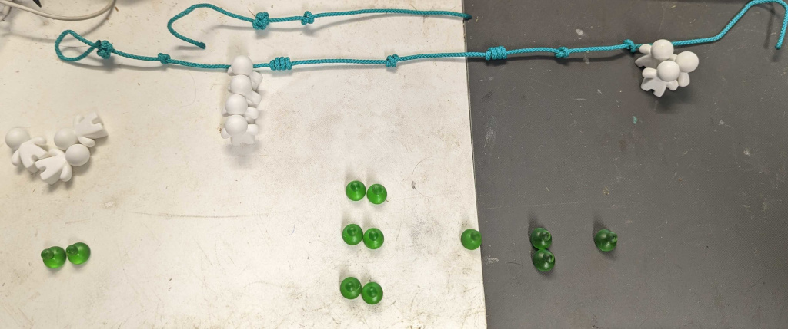

# Battle Example:

Here is an example of a simple battle using rope and tokens (White "peeples" and green tokens I 3D printed as status markers). My character stats are represented by the rope.  On the rope, I made a button knot showing which side is the start, and going from there, you count the number of loops in each knot.  So my character is:

* Level 1
* HP: 4
* STR: 2
* DEX: 4
* INT: 1 (There could be 1 manna token, but there's no need when there's only one)
* Lucky Shots: 1 (3 lucky shots)

The smaller rope on top is used to count the number of XP since my last level up. (1) I tie a simple overhand knot for each xp.

Knots on rope are an easy way to keep track of stats between battles. The knots I use are an overhand knot for "1", a double overhand (or double fisherman's) knot for two, and then just continue adding wraps for 3, 4, etc.

The tokens reflect states that can change, so I have 4 tokens representing my HP, and 3 for my lucky shots. (Remember, each attribute point into lucky shots give you 3 shots)

I'm attacking 3 level 2 monsters:

* HP: 2
* STR: 1
* DEX: 2
* INT: 1

Each row of two HP represents a single monster.  If all the monsters had 1 HP, I would group them together and just remove them one at a time as I killed them.

The tokens on the far left are just extras. If I was using a weapon with bonuses, I would add tokens above my rope to represent a positive stat, and below the rope to represent a negative stat. If your weapon only has positive stats, you could tie the stats on rope, like the character stats. If you have a negative stat, you could tie an extra overhand knot against the knot for the stat showing it's negative.  Or just carve the stat into a stick to make it easy to read.